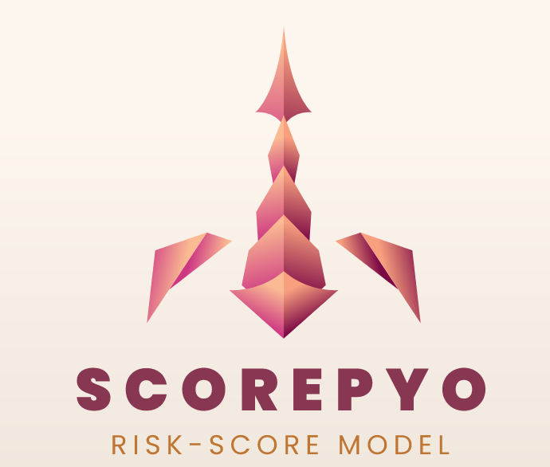

# scorepyo

<!--  -->
<!--  -->

Image by <a href="https://www.freepik.com/free-vector/scorpion-branding-logo-template_21251044.htm#page=2&query=scorpio&from_query=scorpio%20logo&position=3&from_view=search&track=sph">Freepik</a>

Scorepyo is a python package for creating risk-score type models.

Risk-score type model are mostly used in medicine, justice or even psychology. They are widely appreciated, as the computation of the risk is fully explained with a point-card, with points to sum depending on features, and a score-card that associate a score to a risk. The score is computed by summing the points defined by the point-card. The points should be small integers, in order to be easily manipulated by people using them.

You can find hereafter an example of such risk-score model for assessing a stroke risk extracted from :

<a href="http://jmlr.org/papers/v20/18-615.html" target="_blank">Learning Optimized Risk Scores</a>  
Berk Ustun and Cynthia Rudin 
Journal of Machine Learning Research, 2019.

<!--  -->

These models work in a binary classification context, and with binary features. 

The scorepyo package provides two components that can be used indepently:
* Automatic feature binarizer
* Risk-score model

##  Automatic feature binarizer
Datasets usually comes with features of various type. Continuous feature must be binarized in order to fall under the right setting to be used with risk-score model. Scorepyo leverages the great interpet package with EBM to extract binary features.

## Optuna-based Risk score model
The risk-score model can be modeled as an optimization problem with decision variables being :
* which subset of binary features to use
* points associated to each selected binary feature
* log-odd intercept when 0 point

and the optimization function being the logloss of the computed risk on samples

This formulation is not novel, and is used in other packages such as risk-slim or fasterrisk.

The novelty in scorepyo is that it leverages the ability of optuna package to efficiently sample values for the decision variables defined above.

To better understand the justification from automatically creating risk score model from data, and also to not only round coefficients from logistic regression, I refer to the great introduction of this Neurips 2022 paper : https://arxiv.org/pdf/2210.05846.pdf.

Packages that deal with risk-score model are risk-slim and fasterrisk. 

Risk-slim has an elegant exact formulation mixing Machine Learning and Integer Linear Programming, that provide the ability to integrate preference on the feature point setting via constraints. It is unfortunately based ona commercial ILP solver that limits its use, and also will have trouble converging in large dimensions.

Fasterrisk is a recent package that make the computation much faster by dropping the exact approach and providing an other approach to explore this large space of solutions and generate a list of interesting risk-score models that will be diverse. This approach does not integrate constraints as risk-slim does.

